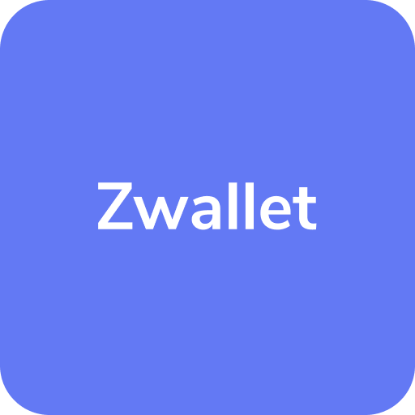

<!-- PROJECT LOGO -->
<br />
<p align="center">
  <a href="https://github.com/BudiSetyo/ZWallet-frontend">
    
  </a>

  <h3 align="center">ZWallet</h3>

  <p align="center">
    This project is the front-end from our assignment of building Wallet App implementing React Native.
    <br />
    <a href="">View Deployed App</a>
    <br />
    (Under Development)
  </p>
</p>

<!-- TABLE OF CONTENTS -->
<details open="open">
  <summary><h2 style="display: inline-block">Contents</h2></summary>
  <ol>
    <li>
      <a href="#about-the-project">About The Project</a>
      <ul>
        <li><a href="#built-with">Built With</a></li>
      </ul>
    </li>
    <li>
      <a href="#getting-started">Getting Started</a>
      <ul>
        <li><a href="#prerequisites">Prerequisites</a></li>
        <li><a href="#installation">Installation</a></li>
      </ul>
    </li>
    <li><a href="#usage">Usage</a></li>
    <li><a href="#roadmap">Roadmap</a></li>

  </ol>
</details>

<!-- ABOUT THE PROJECT -->

## About The Project

This is a front-end project built using React Native which is based on an online wallet application.

### Built With

- [React Native](https://reactnative.dev/)
- [Express](https://expressjs.com/)
- [Javascript](https://www.w3schools.com/js/DEFAULT.asp)

<!-- GETTING STARTED -->

### Installation

1. Clone the repo

   ```sh
   git clone https://github.com/rskrfn/arkaffe-frontend.git
   ```

2. Open the folder

3. Install dependencies

   ```
   type npm install or yarn install in terminal
   ```

4. Run the App

   ```
    type npx react-native run-android in terminal
   ```

   <!-- ROADMAP -->

## Roadmap

This project is our learning step to become a fullstack mobile developer.

```

```
